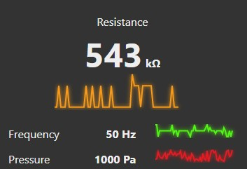

# node-red-contrib-ui-value-trail

[![NPM version][npm-image]][npm-url]

[npm-image]: http://img.shields.io/npm/v/node-red-contrib-ui-value-trail.svg
[npm-url]: https://npmjs.org/package/node-red-contrib-ui-value-trail
Node-RED dashboard widget to show small trail of value history near some numeric value

## Preface
The value trail is not as regular line chart. There is no time component involved. Every incoming payload creates new datapoint. All currently visible datapoints are evenly distributed along x-axis. Also there is not tickmarks or any reference values like minimum or maximum presented. This means that by looking on value trail you can say things like *"Resistance value is ok at 543 kilo ohms but I don't like this strange peak"* or *"Pressure needs some mainteanance cos it shows a lot instability"* 
By all this I want to say that with this widget you can get primary conditions of equipment or measurements but nothing for deep anlyse.

## Configuation
Configurable options:
* Color of line
* Blur (on/off)
* Amount of datapoints per unit. (2 ... 24)
> `unit represents 1x1 Widget Size in dashboard Site configuration` 
 
 ## Input
 The `msg.payload` should carry single numeric value. 
 
 ## Storage
 Widget doesn't use any storage options. There isn't any options to deal with historical data. Only "live" data can be presented.
